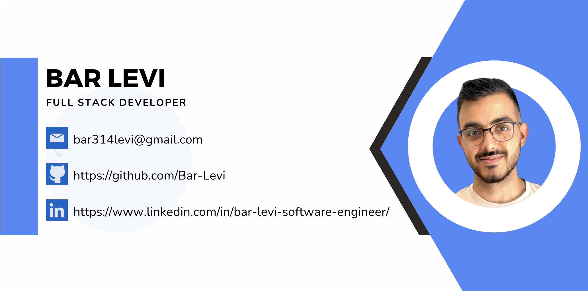

<h1 align="center">Hello 👋  I'm Bar Levi!</h1>
<h2 align="center">🚀 Passionate Full Stack Developer from Israel | Open to New Opportunities 🌟</h2>

---

### 🌟 **About Me:**
I'm Bar Levi, a Software Engineering student (B.Sc.) at SCE graduating in 2025, with a GPA of 92.2. Currently, I'm a Full Stack Developer at Pandatech Group, where I design and develop scalable recruitment solutions. I'm passionate about clean code, scalable architectures, intuitive UX/UI, and continuous learning.

---

### 💼 **Professional Experience:**

- **Full Stack Developer (2024-Present)** | Pandatech Group, Or Yehuda
  - Built a tailored recruitment tool to streamline hiring processes.
  - Collaborated with HR for implementing data-driven solutions.

- **Programming Lecturer (2023-2024)** | Cyber Education Center, Kiryat Malakhi
  - Mentored 20+ students in programming fundamentals (C programming).
  - Guided real-world coding projects and improved problem-solving skills.

---

### 🎓 **Education:**

**B.Sc. Software Engineering** | SCE, Ashdod (2021–2025)
- GPA: 92.2, Rector-President's Award recipient
- Led peer exam preparation, developed various technical projects

---

### 🛠️ **Technical Skills:**

- **Languages:** JavaScript, Python, Java, C, C++
- **Frontend:** React.js, Next.js, HTML5, CSS3, TailwindCSS, Responsive Design
- **Backend:** Node.js, Express.js, Python (FastAPI, Flask), Microservices, REST APIs, Socket.io
- **Databases:** MongoDB, PostgreSQL, Firebase
- **DevOps:** Docker, Render, Netlify, Cloudinary, GitHub Actions, CircleCI
- **Testing:** Cypress, Jest, Pytest, Mocha
- **Tools:** Git, GitHub, Jira, Qase, Postman, Botpress
- **Other Skills:** Linux, OOP, Multi-threading, Design Patterns

---

### 🚀 **Highlighted Projects:**

- **[CareerAgent](https://github.com/Bar-Levi/CareerAgent)** – AI-driven recruitment platform (React.js, Node.js, MongoDB, Gemini AI, Botpress, Socket.IO)
- **[TikTour](https://github.com/Bar-Levi/TikTour-Frontend)** – Global travelers social network (React.js, Node.js, Firebase, Material-UI)

---

### 📫 **Contact Me:**

- **Email:** [bar314levi@gmail.com](mailto:bar314levi@gmail.com)
- **LinkedIn:** [linkedin.com/in/bar-levi-610593219](https://www.linkedin.com/in/bar-levi-610593219)
- **Portfolio:** [bar-levi-portfolio.netlify.app](https://bar-levi-portfolio.netlify.app)
- **Instagram:** [@barlevi99](https://instagram.com/barlevi99)

---

### ⚙️ **Languages & Technologies:**
JavaScript | React | Next.js | Node.js | Python | Java | C | C++ | TailwindCSS | Docker | Git | PostgreSQL | MongoDB | Firebase | Linux

---

### 📊 **GitHub Stats:**

---

**Actively seeking new opportunities as a Full Stack Developer. Let's connect! 🚀**
